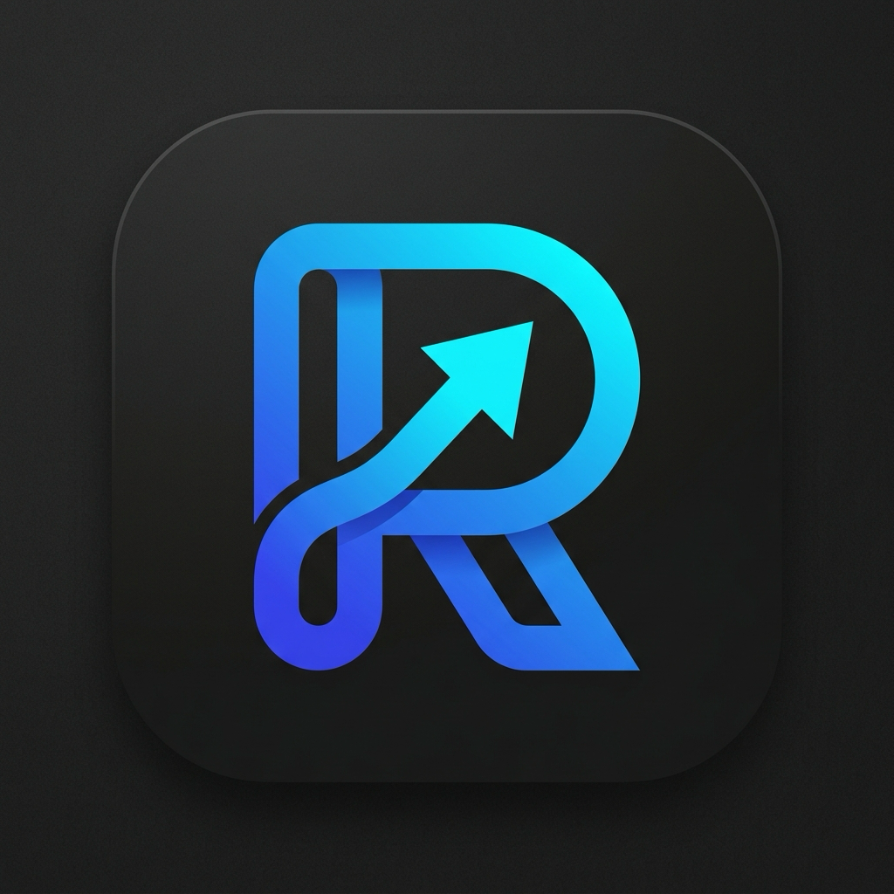
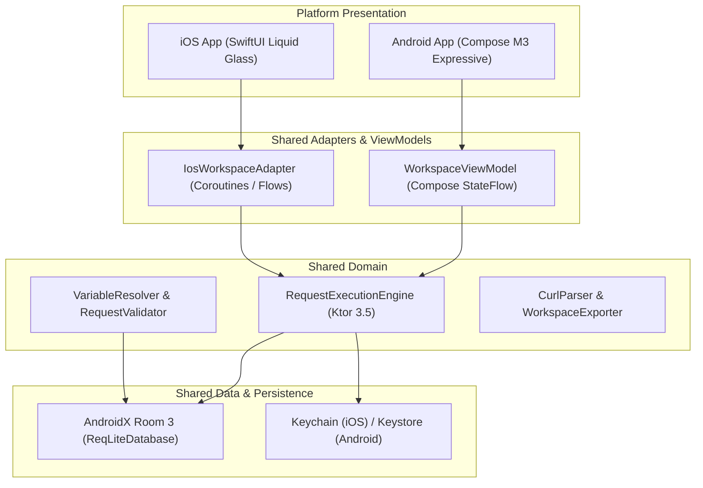

<p align="center">
  
  <h1 align="center">⚡ ReqLite</h1>
  <p align="center">
    <strong>The Elegant, Local-First REST API Client for Mobile</strong><br>
    Built with Kotlin Multiplatform (KMP), Material 3 Expressive (Android), and Liquid Glassmorphism (iOS).
  </p>
</p>

<p align="center">
  <a href="https://github.com/Shahidzbi4213/ReqLite/stargazers"></a>
  <a href="https://github.com/Shahidzbi4213/ReqLite/network/members"></a>
  <a href="https://github.com/Shahidzbi4213/ReqLite/blob/main/LICENSE"></a>
  <a href="https://kotlinlang.org"></a>
  <a href="https://developer.android.com/jetpack/androidx/releases/room"></a>
  <a href="https://ktor.io"></a>
</p>

---

## 📱 Visual Showcase

Experience API testing reimagined for tactile mobile screens — crafted with **Material 3 Expressive** on Android and **Ultra-Thin Liquid Glassmorphism** on iOS.

<p align="center">
  
  &nbsp;&nbsp;&nbsp;&nbsp;&nbsp;&nbsp;
  
</p>

---

## ✨ Key Features

### 🚀 Mobile-First Ergonomics
- **Thumb-Zone Precision**: Actions, method switches, and execute buttons are anchored right where your thumbs rest.
- **Dynamic Method Badges**: Tactile color-coded pill chips for `GET`, `POST`, `PUT`, `DELETE`, `PATCH`, `HEAD`, and `OPTIONS`.
- **Morphing Execution Island**: Animated send, loading, cancel, and retry controls with sub-millisecond response feedback.

### 💎 Dual Native Design Systems
- **iOS Liquid Glass (iOS 26/27 Look)**: Built natively with SwiftUI, featuring `ultraThinMaterial` optical refraction, chromatic glow backdrops, specular rim gradients, and floating glass docks.
- **Android Material 3 Expressive**: Powered by Jetpack Compose with expressive corner hierarchy (999.dp pill shapes), tonal container elevations, and system dynamic theming.

### 💾 Local-First & Room KMP Persistence
- **Zero Cloud Lock-in**: All requests, drafts, collections, and execution journals are stored on-device using **AndroidX Room 3 for Kotlin Multiplatform**.
- **Instant History Replay**: Tap any past request in the history drawer to reload its URL, method, headers, parameters, and payloads into the composer.
- **Crash-Proof Drafts**: Automatically preserves unfinished work with millisecond timestamp uniqueness.

### 🛡️ Production Safety & Smart Environments
- **Environment Isolation**: Seamlessly switch between `Development`, `Staging`, and `Production`.
- **Accidental Wipe Protection**: Built-in safety warnings alert you before executing state-changing mutations (`POST`/`PUT`/`DELETE`) against protected live environments.

### ⚡ Developer Power Tools
- **cURL Parser**: Paste raw cURL commands from your clipboard and immediately transform them into structured requests.
- **Postman Collection Import**: Import Postman collections (v2.0 / v2.1) directly from files, JSON text, or samples, automatically extracting variables into local environments.
- **QR Code Scanner**: Instantly scan endpoint configurations and auth tokens using native cameras (`DataScannerViewController` on iOS, `ZXing` on Android).
- **Deep Response Inspector**: Fast JSON tree parsing with search filtering, status pill chips, duration counters, and raw/pretty switching.
- **Hardware-Backed Secret Vault**: Credentials stored securely via **iOS Keychain** and **Android Keystore** with opaque database references.

---

## 🏗️ Architecture & Tech Stack

ReqLite follows modern clean architecture with strict unidirectional data flow (UDF) across shared Kotlin Multiplatform layers:



| Layer | Technologies |
|---|---|
| **Language** | Kotlin 2.4 (KMP), Swift 6 / SwiftUI |
| **UI Android** | Jetpack Compose, Material 3 Expressive, Adaptive Navigation |
| **UI iOS** | Native SwiftUI, Liquid Glass System, Ultra-Thin Materials |
| **Networking** | Ktor Client 3.5 (Darwin Engine for iOS, OkHttp for Android) |
| **Local Database** | AndroidX Room 3.0.1 (Bundled SQLite Driver) |
| **Dependency Injection** | Koin 4.2 |
| **Security** | iOS Keychain Services, Android Keystore API |
| **Serialization** | Kotlinx.Serialization JSON |

---

## 🛠️ Getting Started

### Prerequisites
- **JDK 17+**
- **Android Studio Ladybug / Meerkat** (for Android)
- **Xcode 16+** with iOS 16.0+ SDK (for iOS)
- macOS (required to build both Android and iOS targets)

### Cloning the Repository
```bash
git clone https://github.com/Shahidzbi4213/ReqLite.git
cd ReqLite
```

### Running on Android
Open the project in Android Studio, select the `androidApp` configuration, and run on an emulator or device:
```bash
./gradlew :androidApp:installDebug
```

### Running on iOS
Open the Xcode workspace or build directly from your terminal:
```bash
xcodebuild -project iosApp/iosApp.xcodeproj \
  -scheme iosApp \
  -destination 'generic/platform=iOS Simulator' \
  build
```
Or launch through Xcode by opening `iosApp/iosApp.xcodeproj`.

---

## 🧪 Testing

ReqLite has dedicated multiplatform and native test suites:

```bash
# Run shared KMP common unit tests
./gradlew :shared:allTests

# Run iOS Simulator unit tests
./gradlew :shared:iosSimulatorArm64Test

# Run Android unit tests
./gradlew :androidApp:testDebugUnitTest
```

---

## 🗺️ Roadmap

- [x] Android Material 3 Expressive overhaul
- [x] iOS Liquid Glassmorphism design system
- [x] Room 3.0 KMP persistence on iOS & Android
- [x] Request History drawer & one-tap replay
- [x] QR code configuration scanning
- [x] Postman collection import (v2.0 & v2.1) & environment variable resolution
- [ ] Insomnia collection import & workspace export
- [ ] WebSocket and Server-Sent Events (SSE) streaming
- [ ] GraphQL query autocompletion & schema explorer
- [ ] Scriptable pre-request & post-request test assertions

---

## 🤝 Contributing

Contributions are welcome! Whether it's reporting a bug, improving the documentation, or proposing new features:
1. Fork the Project (`https://github.com/Shahidzbi4213/ReqLite/fork`)
2. Create your Feature Branch (`git checkout -b feature/AmazingFeature`)
3. Commit your Changes (`git commit -m 'feat: add some amazing feature'`)
4. Push to the Branch (`git push origin feature/AmazingFeature`)
5. Open a Pull Request

---

## 📄 License

Distributed under the Apache 2.0 License. See [`LICENSE`](LICENSE) for more information.

<p align="center">
  Crafted with ❤️ for mobile developers worldwide. Give it a ⭐ if you found it useful!
</p>
